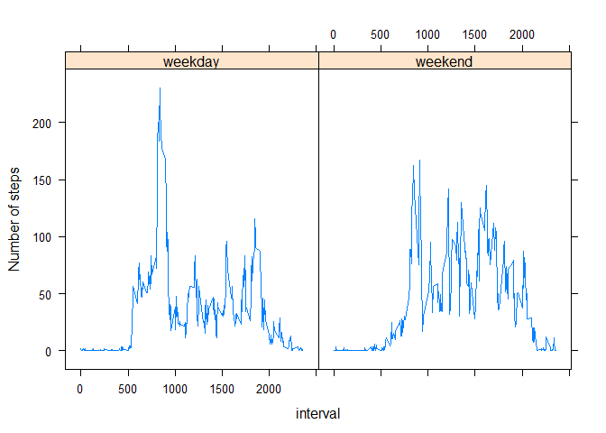

Introduction
------------

It is now possible to collect a large amount of data about personal
movement using activity monitoring devices such as a Fitbit, Nike
Fuelband, or Jawbone Up. These type of devices are part of the
"quantified self" movement - a group of enthusiasts who take
measurements about themselves regularly to improve their health, to find
patterns in their behavior, or because they are tech geeks. But these
data remain under-utilized both because the raw data are hard to obtain
and there is a lack of statistical methods and software for processing
and interpreting the data.

This assignment makes use of data from a personal activity monitoring
device. This device collects data at 5 minute intervals through out the
day. The data consists of two months of data from an anonymous
individual collected during the months of October and November, 2012 and
include the number of steps taken in 5 minute intervals each day.

Data
----

The data for this assignment is downloaded from the course web site.

The variables included in this dataset are:

-   steps: Number of steps taking in a 5-minute interval (missing values
    are coded as NA)
-   date: The date on which the measurement was taken in YYYY-MM-DD
    format
-   interval: Identifier for the 5-minute interval in which measurement
    was taken

There are a total of 17,568 observations in this dataset.

Loading and preprocessing the data
----------------------------------

Loading the activityData

    activityData <- read.csv("repdata_data_activity/activity.csv", header = TRUE, sep = ",")
    activityData$date <- as.Date(activityData$date, "%Y-%m-%d")

What is mean total number of steps taken per day?
-------------------------------------------------

Missing values in the dataset are ignored.

The total number of steps taken per day is calculated and histogram of
the total number of steps taken each day is shown below,

    totalStepsPerDay <- tapply(activityData$steps, activityData$date, sum, na.rm=T)
    hist(totalStepsPerDay, xlab = "sum of steps per day", main = "histogram of steps per day")

The mean and median of the total number of steps taken per day is

    totalStepsPerDay_mean <- round(mean(totalStepsPerDay))
    totalStepsPerDay_median <- round(median(totalStepsPerDay))
    print(paste("The Mean is ",totalStepsPerDay_mean," and the Median is ",totalStepsPerDay_median))

    ## [1] "The Mean is  9354  and the Median is  10395"

What is the average daily activity pattern?
-------------------------------------------

    dap_int <- tapply(activityData$steps, activityData$interval, mean, na.rm=T)
    plot(dap_int ~ unique(activityData$interval), type="l", xlab = "5-min interval")

    dap_int[which.max(dap_int)]

    ##      835 
    ## 206.1698

Imputing missing values
-----------------------

Note that there are a number of days/intervals where there are missing
values (coded as NA). The presence of missing days may introduce bias
into some calculations or summaries of the data.

In order to visualize in which variable the NAs are

    totalMean=mean(is.na(activityData$steps))
    print(paste("The Mean of Steps Without NAs is ",round(totalMean,4),"."))

    ## [1] "The Mean of Steps Without NAs is  0.1311 ."

    totalNAs=sum(is.na(activityData$steps))
    print(paste("All of the NA's are in the steps variable. There are ",totalNAs," NA's."))

    ## [1] "All of the NA's are in the steps variable. There are  2304  NA's."

Strategy for filling in all of the missing values in the dataset
----------------------------------------------------------------

The following strategy is chosen: for any NA is the step variable, the
mean (of steps) of the corresponding interval is taken as the replacing
value.

The 'mn\_int' contains the mean for each single interval calculated over
the 61 days. The right value coming from 'mn\_int' is going to be used
to replace the NA at the same interval.

    activity2 <- activityData  # creation of the dataset that will have no more NAs
    for (i in 1:nrow(activityData)){
        if(is.na(activityData$steps[i])){
            activity2$steps[i]<- dap_int[[as.character(activityData[i, "interval"])]]
        }
    }

Below is a histogram of the total number of steps taken each day. The
mean and median total number of steps taken per day are reported.

    totalStepsPerDay2 <- tapply(activity2$steps, activity2$date, sum, na.rm=T)
    hist(totalStepsPerDay2, xlab = "sum of steps per day", main = "histogram of steps per day")

    totalStepsPerDay_mean2 <- round(mean(totalStepsPerDay2))
    totalStepsPerDay_median2 <- round(median(totalStepsPerDay2))
    print(paste("The Mean is ",totalStepsPerDay_mean2," and the Median is ",totalStepsPerDay_median2))

    ## [1] "The Mean is  10766  and the Median is  10766"

In order to compare the new values with the "old" values:

    df_summary=NULL
    df_summary <- rbind(df_summary, data.frame(mean = c(totalStepsPerDay_mean, totalStepsPerDay_mean2), median = c(totalStepsPerDay_median, totalStepsPerDay_median2)))
    rownames(df_summary) <- c("with NA's", "without NA's")
    print(df_summary)

    ##               mean median
    ## with NA's     9354  10395
    ## without NA's 10766  10766

It confirms there is no more NAs in the steps variable.

Are there differences in activity patterns between weekdays and weekends?
-------------------------------------------------------------------------

A new column is added to the dataframe, this column will contain the
factor "weekday days"" or "weekend days".

    activity2$weekday <- c("weekday")
    activity2[weekdays(as.Date(activity2[, 2])) %in% c("Saturday", "Sunday", "samedi", "dimanche", "saturday", "sunday", "Samedi", "Dimanche"), ][4] <- c("weekend")
    activity2$weekday <- factor(activity2$weekday)

In order to visualize the difference bewteen weekends and days of the
week, a new dataframe is created to be usable by the lattice package.
First, the data are calculated:

    activity2_weekend <- subset(activity2, activity2$weekday == "weekend")
    activity2_weekday <- subset(activity2, activity2$weekday == "weekday")

    mean_activity2_weekday <- tapply(activity2_weekday$steps, activity2_weekday$interval, mean)
    mean_activity2_weekend <- tapply(activity2_weekend$steps, activity2_weekend$interval, mean)

Then the dataframe is prepared and the plot is. plotted !

    library(lattice)
    df_weekday <- NULL
    df_weekend <- NULL
    df_final <- NULL
    df_weekday <- data.frame(interval = unique(activity2_weekday$interval), avg = as.numeric(mean_activity2_weekday), day = rep("weekday", length(mean_activity2_weekday)))
    df_weekend <- data.frame(interval = unique(activity2_weekend$interval), avg = as.numeric(mean_activity2_weekend), day = rep("weekend", length(mean_activity2_weekend)))
    df_final <- rbind(df_weekday, df_weekend)
    xyplot(avg ~ interval | day, data = df_final,
           type = "l", ylab = "Number of steps")

It can be observed that there is a small difference between the period.
